# Do IT Girls Coding Session!

Today we are going to make our first game! How exciting!

## Register for GitHub

Please follow these steps to register for GitHub. You only need an email address to sign up.

1. Go to https://github.com

2. Click on Sign Up

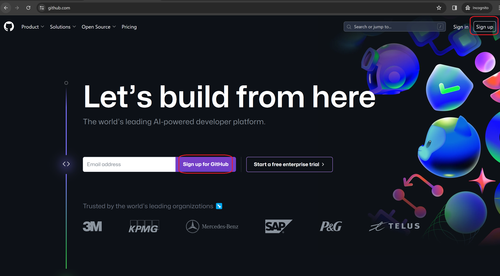

3. Fill in your email address

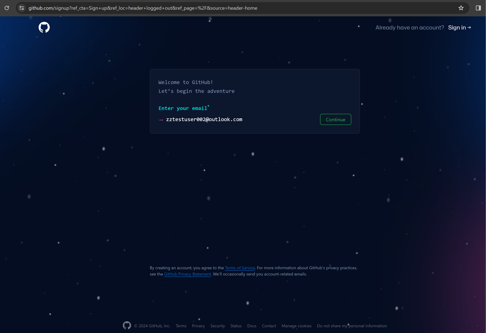

4. Create a password

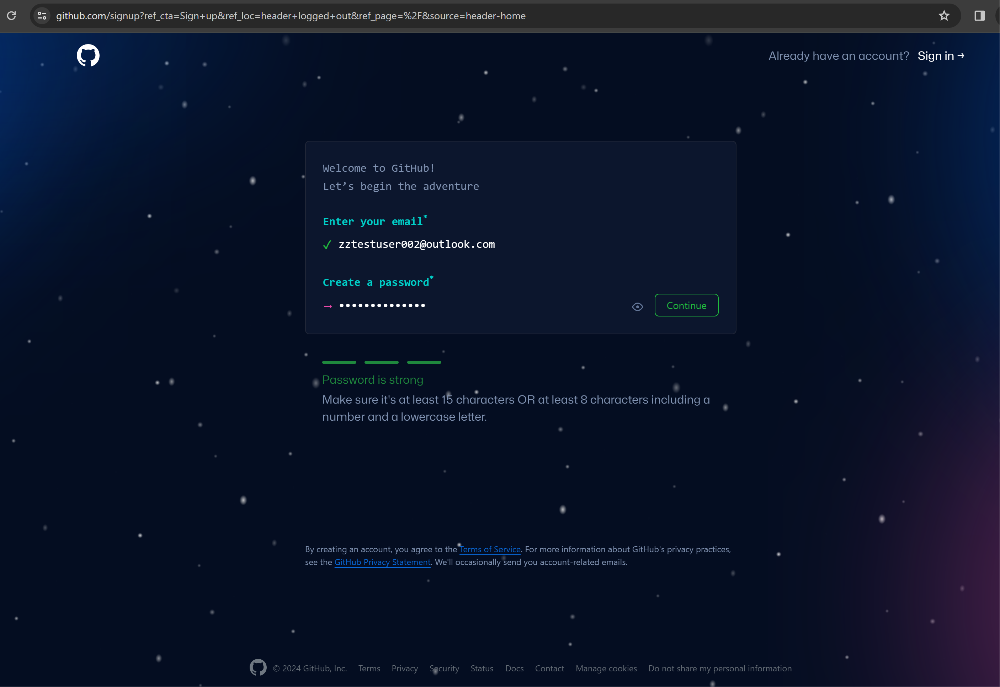

5. Choose a username

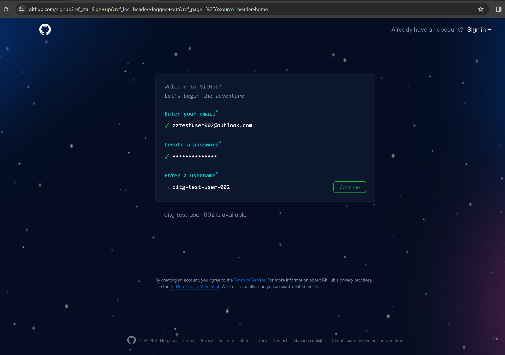

6. Leave the email prefernces unticked and click on the green button to Continue

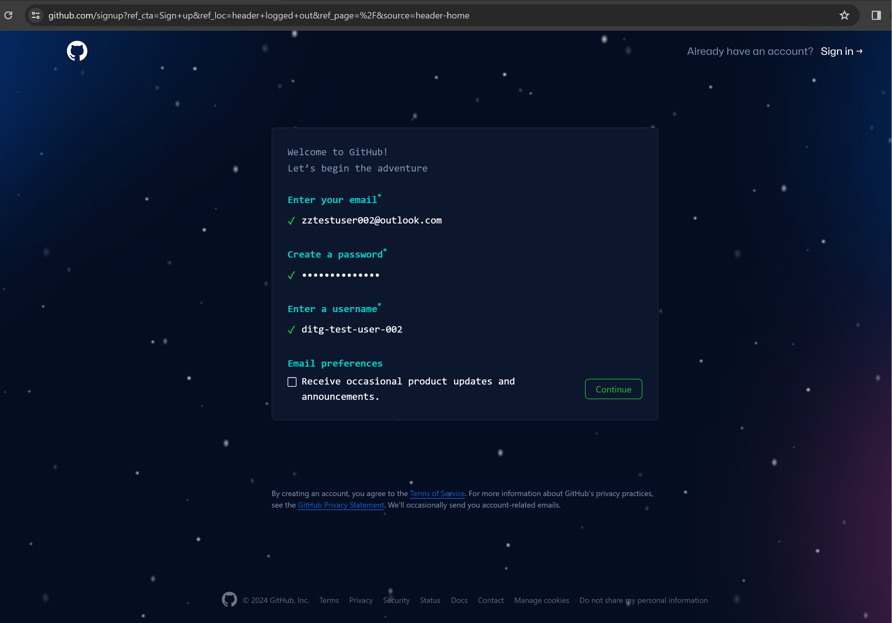

7. Click on the Verify button to start the puzzle. This puzzle is essential to prove that the user is a human and not a robot. You will need to match the picture on the left with the correct picture on the right. Click on left and right arrows to scroll through the pictures. Once you have found the match, click on the Submit button to complete the puzzle.

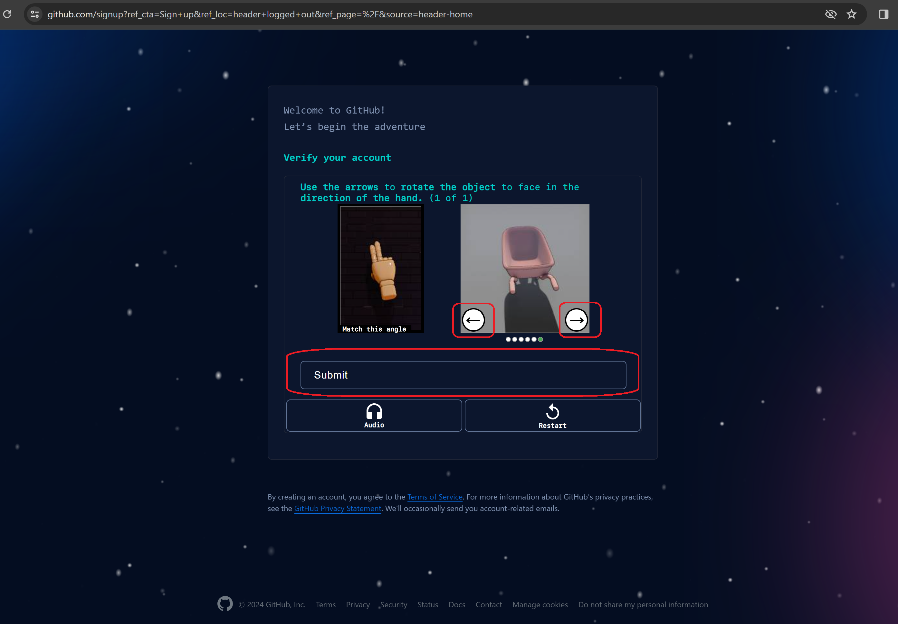

8. If the puzzle is completed successfully, GitHub will send you a numeric code to your email address. You'll need to enter that code to complete the registration.

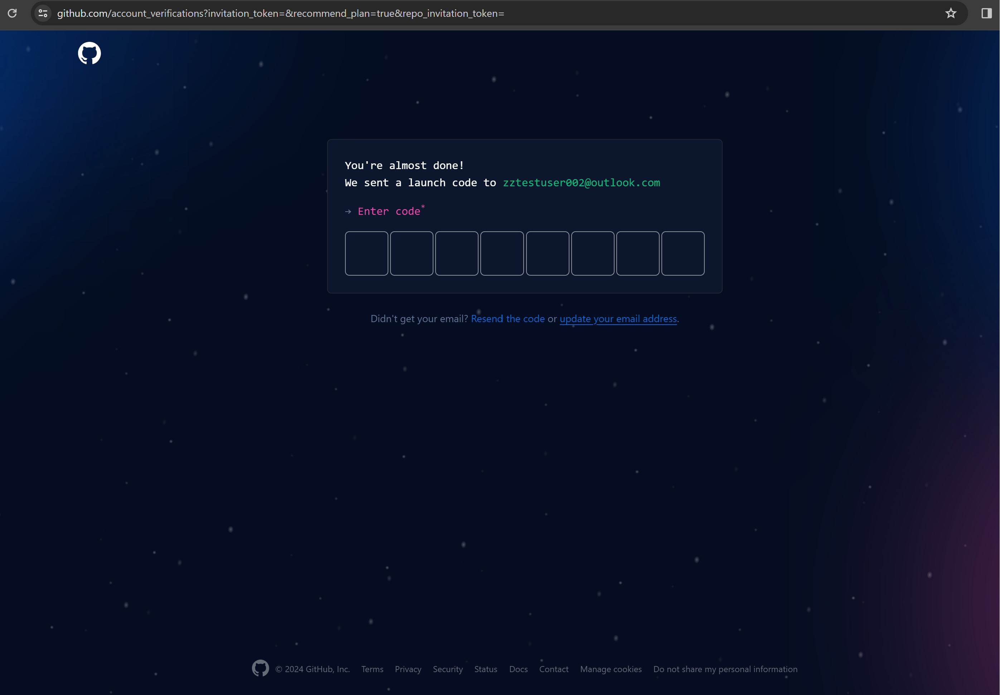

9. When the registration is completed, you'll see a welcome page. Select `Just me` or `Student`, then click Continue, and on the next page click Continue as well.

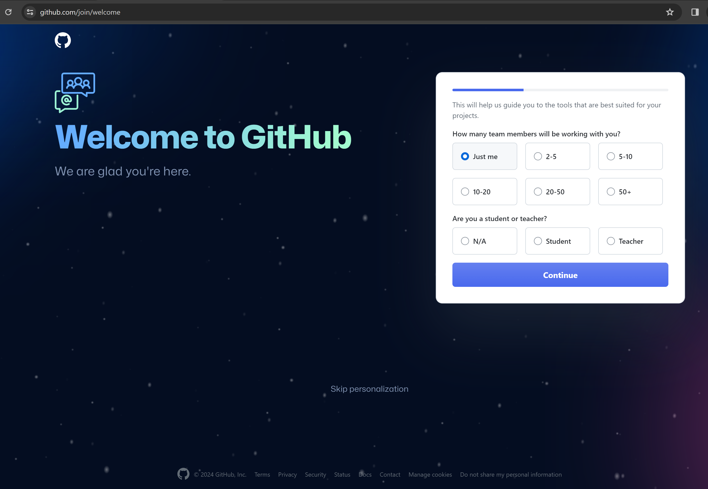

10. In the next step, you can choose your plan. Select the Free plan.

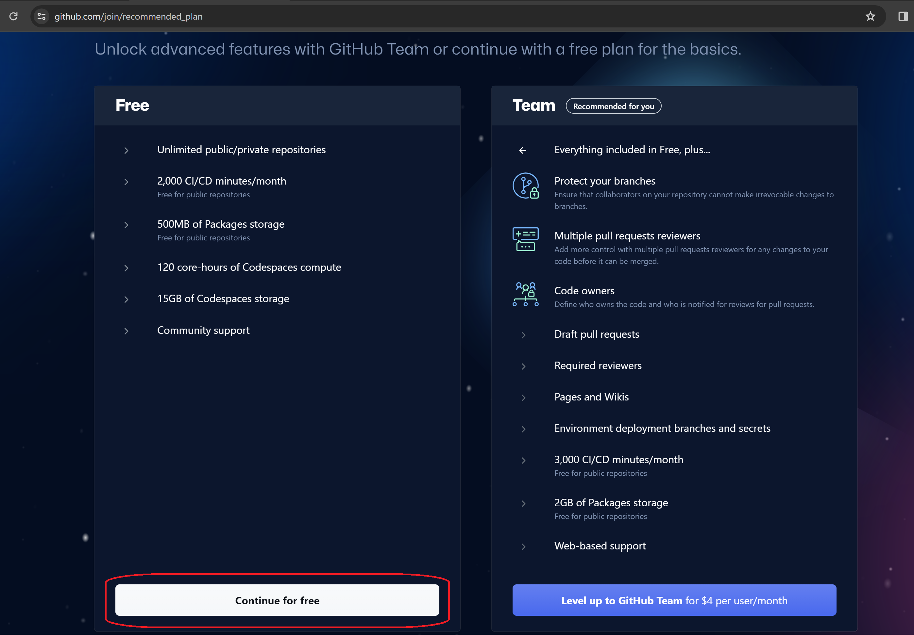

11. Congratulations! You have successfully completed the GitHub registration.

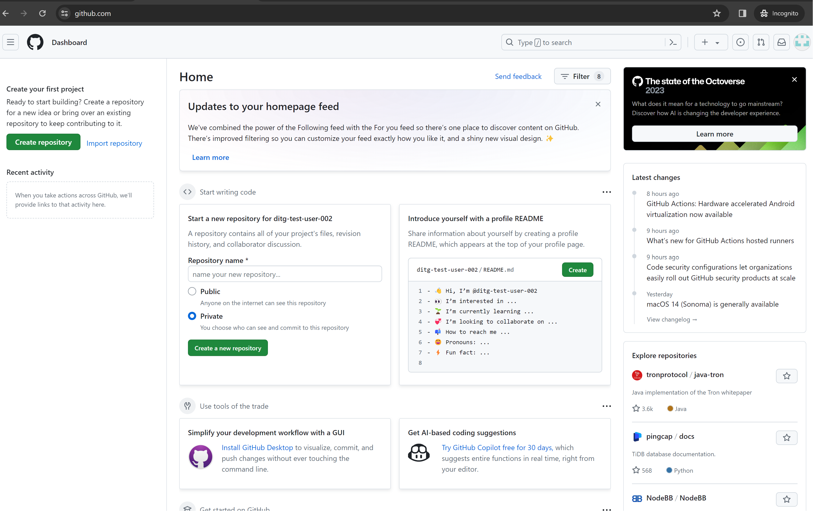


## Fork this repo

Click on the Fork button to create your own copy of your repo

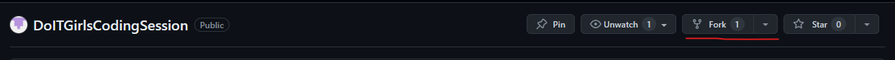

## Create a codespace

Click on the create codespace button

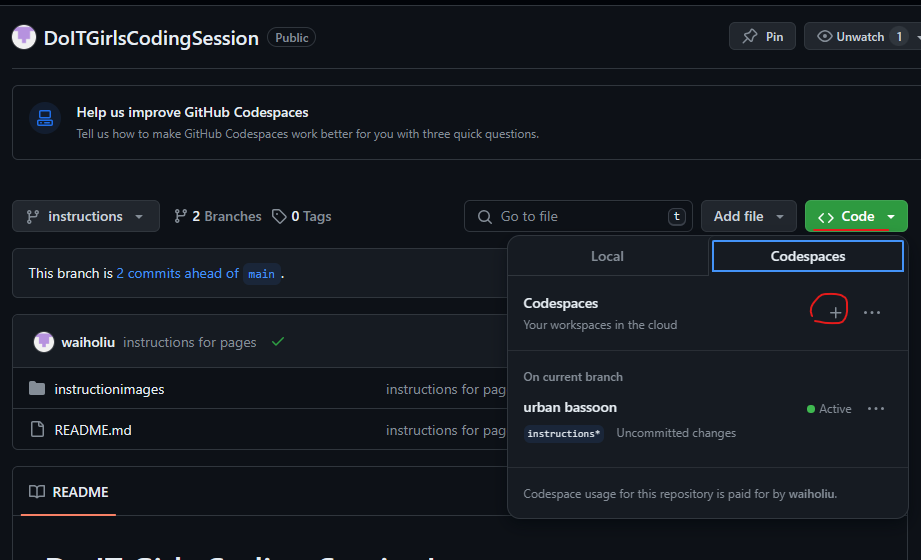


## Create your Quiz game

1. Create a file called index.html 

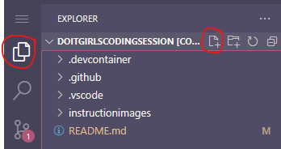

Paste in the following code

```
<html lang="en">

<head>

  <meta charset="UTF-8">

  <meta name="viewport" content="width=device-width, initial-scale=1.0">

  <meta http-equiv="X-UA-Compatible" content="ie=edge">

  <link href="style.css" rel="stylesheet">

  <script defer src="script.js"></script>

  <title>Quiz App</title>

</head>

<body>

  <div class="container">

    <div id="question-container" class="hide">

      <div id="question">Question</div>

      <div id="answer-buttons" class="btn-grid">

        <button class="btn">Answer 1</button>

        <button class="btn">Answer 2</button>

        <button class="btn">Answer 3</button>

        <button class="btn">Answer 4</button>

      </div>

    </div>

    <div class="controls">

      <button id="start-btn" class="start-btn btn">Start</button>

      <button id="next-btn" class="next-btn btn hide">Next</button>

    </div>

  </div>

</body>

</html>
```

2. Create a file called script.js and paste the following in

```
const startButton = document.getElementById('start-btn')

const nextButton = document.getElementById('next-btn')

const questionContainerElement = document.getElementById('question-container')

const questionElement = document.getElementById('question')

const answerButtonsElement = document.getElementById('answer-buttons')

let shuffledQuestions, currentQuestionIndex

startButton.addEventListener('click', startGame)

nextButton.addEventListener('click', () => {

  currentQuestionIndex++

  setNextQuestion()

})

function startGame() {

  startButton.classList.add('hide')

  shuffledQuestions = questions.sort(() => Math.random() - .5)

  currentQuestionIndex = 0

  questionContainerElement.classList.remove('hide')

  setNextQuestion()

}

function setNextQuestion() {

  resetState()

  showQuestion(shuffledQuestions[currentQuestionIndex])

}

function showQuestion(question) {

  questionElement.innerText = question.question

  question.answers.forEach(answer => {

    const button = document.createElement('button')

    button.innerText = answer.text

    button.classList.add('btn')

    if (answer.correct) {

      button.dataset.correct = answer.correct

    }

    button.addEventListener('click', selectAnswer)

    answerButtonsElement.appendChild(button)

  })

}

function resetState() {

  clearStatusClass(document.body)

  nextButton.classList.add('hide')

  while (answerButtonsElement.firstChild) {

    answerButtonsElement.removeChild(answerButtonsElement.firstChild)

  }

}

function selectAnswer(e) {

  const selectedButton = e.target

  const correct = selectedButton.dataset.correct

  setStatusClass(document.body, correct)

  Array.from(answerButtonsElement.children).forEach(button => {

    setStatusClass(button, button.dataset.correct)

  })

  if (shuffledQuestions.length > currentQuestionIndex + 1) {

    nextButton.classList.remove('hide')

  } else {

    startButton.innerText = 'Restart'

    startButton.classList.remove('hide')

  }

}

function setStatusClass(element, correct) {

  clearStatusClass(element)

  if (correct) {

    element.classList.add('correct')

  } else {

    element.classList.add('wrong')

  }

}

function clearStatusClass(element) {

  element.classList.remove('correct')

  element.classList.remove('wrong')

}

const questions = [

  {

    question: 'What is 2 + 2?',

    answers: [

      { text: '4', correct: true },

      { text: '22', correct: false }

    ]

  },

  {

    question: 'Who is the best YouTuber?',

    answers: [

      { text: 'Web Dev Simplified', correct: true },

      { text: 'Traversy Media', correct: true },

      { text: 'Dev Ed', correct: true },

      { text: 'Fun Fun Function', correct: true }

    ]

  },

  {

    question: 'Is web development fun?',

    answers: [

      { text: 'Kinda', correct: false },

      { text: 'YES!!!', correct: true },

      { text: 'Um no', correct: false },

      { text: 'IDK', correct: false }

    ]

  },

  {

    question: 'What is 4 * 2?',

    answers: [

      { text: '6', correct: false },

      { text: '8', correct: true }

    ]

  }

]
```


3. Create a file called style.css and paste the following in


```
*, *::before, *::after {

    box-sizing: border-box;
  
    font-family: Gotham Rounded;
  
  }
  
  :root {
  
    --hue-neutral: 200;
  
    --hue-wrong: 0;
  
    --hue-correct: 145;
  
  }
  
  body {
  
    --hue: var(--hue-neutral);
  
    padding: 0;
  
    margin: 0;
  
    display: flex;
  
    width: 100vw;
  
    height: 100vh;
  
    justify-content: center;
  
    align-items: center;
  
    background-color: hsl(var(--hue), 100%, 20%);
  
  }
  
  body.correct {
  
    --hue: var(--hue-correct);
  
  }
  
  body.wrong {
  
    --hue: var(--hue-wrong);
  
  }
  
  .container {
  
    width: 800px;
  
    max-width: 80%;
  
    background-color: white;
  
    border-radius: 5px;
  
    padding: 10px;
  
    box-shadow: 0 0 10px 2px;
  
  }
  
  .btn-grid {
  
    display: grid;
  
    grid-template-columns: repeat(2, auto);
  
    gap: 10px;
  
    margin: 20px 0;
  
  }
  
  .btn {
  
    --hue: var(--hue-neutral);
  
    border: 1px solid hsl(var(--hue), 100%, 30%);
  
    background-color: hsl(var(--hue), 100%, 50%);
  
    border-radius: 5px;
  
    padding: 5px 10px;
  
    color: white;
  
    outline: none;
  
  }
  
  .btn:hover {
  
    border-color: black;
  
  }
  
  .btn.correct {
  
    --hue: var(--hue-correct);
  
    color: black;
  
  }
  
  .btn.wrong {
  
    --hue: var(--hue-wrong);
  
  }
  
  .start-btn, .next-btn {
  
    font-size: 1.5rem;
  
    font-weight: bold;
  
    padding: 10px 20px;
  
  }
  
  .controls {
  
    display: flex;
  
    justify-content: center;
  
    align-items: center;
  
  }
  
  .hide {
  
    display: none;
  
  }
  ```


## Testing out the game

Right click on the file you want and click Open with Live Server

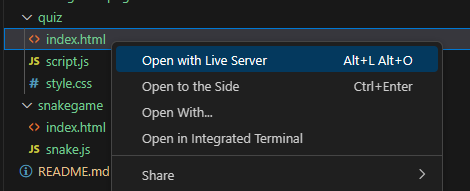


## deploy to github pages

Go to Settings

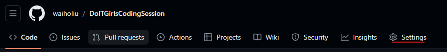

Go to Pages

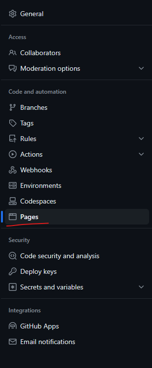


Set branch to Main and save


Give it a minute - navigate to https://<yourusername>.github.io/<reponame> and you now have a publicly available webpage. Every time you make changes to your code, it'll automatically update too - send it to a friend!


## Additional Challenges

## Quiz 
-  How can I add a title to the page
-  Can you give your quiz a title?
-  Can you style it to make it look nicer?
-  Can you design your own quiz

## Snake Game

Alternatively, if you're sick of the quiz game, lets create another game. We'll make a Snake Game this time.

1. Create another file called index-snake.html. PAste the following code in

```
<html>
    <head>
        <script src="snake.js"></script>

    </head>
    <body>
        <canvas id="gc" width="400" height="400"></canvas>
        <div id="variables"></div>
    </body>
</html>
```

2. Create another file called snake.js and paste the following code in

```

window.onload = function () {

    canv = document.getElementById("gc");

    ctx = canv.getContext("2d");

    document.addEventListener("keydown", keyPush);

    setInterval(game, 1000 / 15);

}

playerX = playerY = 10;

gridSize = 20;
tileCount = 20;

appleX = appleY = 15;

xVelocity = yVelocity = 0;

trail = [];

tailLength = 5;

function game() {

    playerX += xVelocity;

    playerY += yVelocity;

    if (playerX < 0) {

        playerX = tileCount - 1;

    }

    if (playerX > tileCount - 1) {

        playerX = 0;

    }

    if (playerY < 0) {

        playerY = tileCount - 1;


    }

    if (playerY > tileCount - 1) {

        playerY = 0;

    }

    ctx.fillStyle = "black";

    ctx.fillRect(0, 0, canv.width, canv.height);


    ctx.fillStyle = "lime";

    for (var i = 0; i < trail.length; i++) {

        ctx.fillRect(trail[i].x * gridSize, trail[i].y * gridSize, gridSize - 2, gridSize - 2);

        if (trail[i].x == playerX && trail[i].y == playerY) {

            tailLength = 5;

        }

    }

    trail.push({ x: playerX, y: playerY });

    while (trail.length > tailLength) {

        trail.shift();

    }


    if (appleX == playerX && appleY == playerY) {

        tailLength++;

        appleX = Math.floor(Math.random() * tileCount);

        appleY = Math.floor(Math.random() * tileCount);

    }

    ctx.fillStyle = "red";

    ctx.fillRect(appleX * gridSize, appleY * gridSize, gridSize - 2, gridSize - 2);

    // Get the variables area
    var variablesArea = document.getElementById("variables");

    // Output the variables
    variablesArea.innerHTML = 
        "Player X: " + playerX + "<br>" +
        "Player Y: " + playerY + "<br>" +
        "Grid Size: " + gridSize + "<br>" +
        "Tile Count: " + tileCount + "<br>" +
        "Apple X: " + appleX + "<br>" +
        "Apple Y: " + appleY + "<br>" +
        "X Velocity: " + xVelocity + "<br>" +
        "Y Velocity: " + yVelocity + "<br>" +
        "Tail Length: " + tailLength;

}

function keyPush(evt) {

    switch (evt.keyCode) {

        case 37:

            xVelocity = -1; yVelocity = 0;

            break;

        case 38:

            xVelocity = 0; yVelocity = -1;

            break;

        case 39:

            xVelocity = 1; yVelocity = 0;

            break;

        case 40:

            xVelocity = 0; yVelocity = 1;

            break;

    }

}
```


Use the live server and get it working again!

## Additional cHallenges for snake game

- How can I change the colours of the dots and the background?
- How can I slow down or speed up the snake?


## Resources

Youtube video explanation of how to make the Snake Game (https://www.youtube.com/watch?v=xGmXxpIj6vs)

Youtube video explanation of how to make the quiz (https://www.youtube.com/watch?v=riDzcEQbX6k)

More games you can make for yourself (https://www.ansoriweb.com/2020/03/javascript-game.html)

